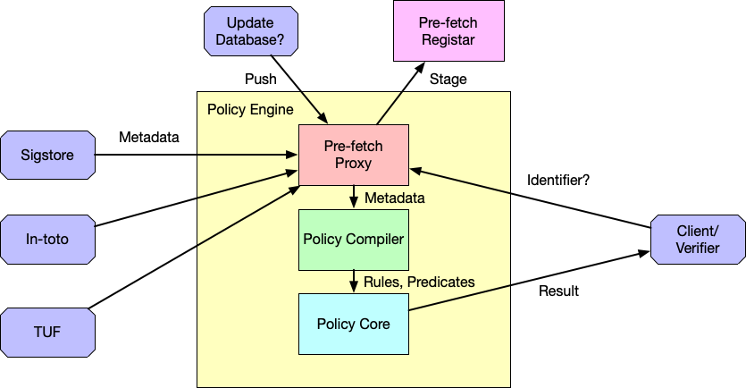

# PolicyEngineDemo
This is a simple demo for a logic-based policy engine design. Currently this demo shows two simple examples for enforcing policy checks on TUF and In-toto trust metadata.


## Draft Policy Language Syntax *
We separate the language syntax in two parts a schema format and a policy format

The schema format shows how to interpret the trust metadata file and build a fact library. 

```
speaker([condition])$:relation([facts]).
```

=>

```
struct Rules{
    speaker: String,
    condition: Vec<String>,
    relation: String,
    facts: Vec<String>,
    flag: bool
}
```

A simple translation of the above schema is "a speaker says a relation between several facts under a set of conditions" (See [Intoto_example](Rules/Intoto.schema) as an example). Each JSON object in the trust metatdata file is translated into a logic fact/predicate in the format of `relation(speaker, [facts]).` If there is no declared relation for a speaker, the default relation `sign` is used.

The policy format inherits the logic language syntax to validate against facts or define rules to reason about facts. 

For example, the following rule from [tuf_example](Rules/tuf.rule) validates that a filename binds with a key based on hash matching and key delegation.
```
role_key(K, F):-
    sign(F, FL),
    hash(K1, KL1),
    member(H, KL1),
    member(K1, FL),
    meta(K2, ML),
    member(F, ML),
    signatures(K3, KL3),
    member(K, KL3),
    sign(H, HL),
    member(K3, HL).
```

### speaker
Speaker is the owner of a predicate/rule. In trust logic, a speaker is an authenticated principal whose identity is unique and verifiable. 

Currently this demo uses the hash of the content as the principal id for three reasons:
* Trust metadata format (Intoto, Tuf) contains unnamed/randomly named JSON objects, which need a unique self-verifiable identifier
* Tuf infrastructure requires file hash validation 
* Intoto and Tuf allows multiple signatures from different keys for a single file, which makes it hard for authority delegation without a central root.

However, the metadata owner can override the choice of root speaker by declaring a rule to set a root speaker of the file. Internal unnamed objects will always use hash as the identifier.

### facts
Facts are a set of properties in the trust metadata. In our language, we have 4 basic types of the fact: `String`, `Number`, `Array`, `Object`.

The first 3 types are generic property types that directly reflects the value in the predicates. The `Object` is a principal of certain properties and will be replaced by its principal id when we capture it in this predicate.

### relation
A relation is a rule or predicate about the facts. Under the same domain/namespace, a relation should have a consistent format(number and sequence of the facts) regardless of the speaker or facts for the ease of matching procedure.


### conditions
Conditions are optional. They define the circumstances where the claim from speaker to the relation of facts is valid. The conditions can also be used as a simple pattern matching style expression of policy or rules.


## Todo List and Challenges?

- [ ] Compiler of the policy engine
    - [x] a general parser for the trust metadata 
        - [x] in JSON format
        - [ ] support for ymal format?
    
- [ ] Logic core of the policy engine
    - [x] a general parser for policy language
        - [x] a struct of single predicate
        - [x] speaker identifier
    - [ ] matching engine

- [ ] Syntax of our policy language
    - [ ] predicates
        - [ ] speaker
        - [ ] relation
        - [ ] facts
        - [ ] conditions
    - [ ] facts
        - [x] String
        - [x] Number
        - [ ] Array
        - [ ] Object

## RUN
This demo requires rust and swi-prolog installation. For simplicity, a docker container is recommanded.


```
docker run -it --rm --name demo -v $PWD:/home iqicheng/rust-logic-engine-demo bash
cd home/
cargo run Intoto DemoData/Intoto/
cargo run Intoto DemoData/Intoto_fake/
cargo run tuf DemoData/tuf/
```

## Example Output
The output is in the `Example_Output` folder. The [In-toto.pl](Example_Output/Intoto/Intoto.pl) file is the matching procedure, all other files are facts and predicates from trust metadata. 
## Design Ideas 
This is a simple first-draft design blueprint.


